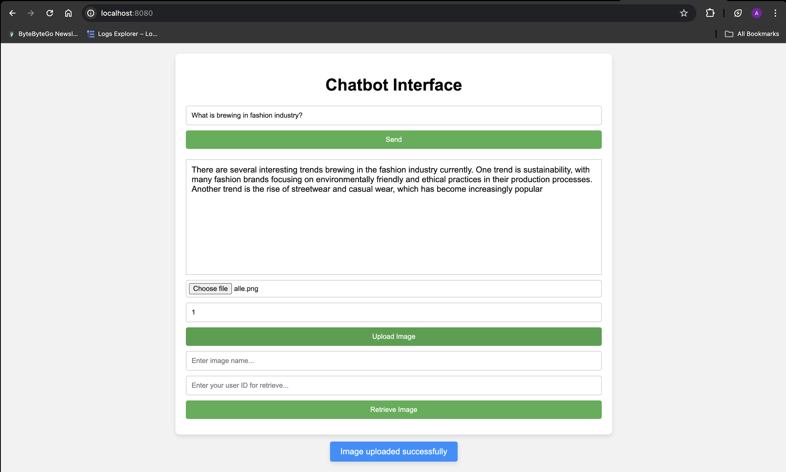
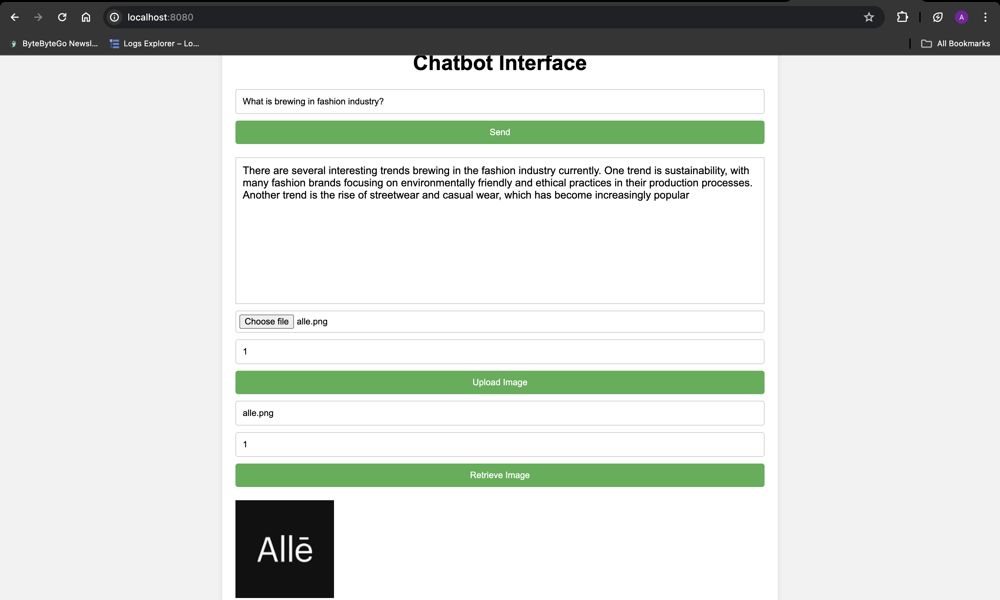

# Go Chatbot Application

This chatbot application is built with Go and integrates OpenAI's GPT for conversational capabilities. It allows users to save and retrieve images, leveraging AWS S3 for storage.

## Features

- Conversational interactions using OpenAI's GPT.
- Image upload and retrieval using AWS S3.
- Dockerized application for easy deployment.

## Prerequisites

Before you begin, ensure you have met the following requirements:

- Go (version 1.18 or above)
- Docker and Docker Compose (for containerization and deployment)
- An OpenAI API key
- AWS account with S3 access

## Setting Up for Development

1. Clone the repository:
    ```
    git clone https://github.com/atul107/chatbot.git
    cd chatbot
    ```

2. setup project :
    ```
    make setup
    ```

3. Update `.env` with your OpenAI API key and AWS S3 details


4. Run the application:
    ```
    make run
    ```

## Running Tests

To run tests, execute the following command:
    ```
    make test
    ```

## Deployment

This application can be deployed using Docker. To build and run the Docker container:

1. Build the Docker image:
    ```
    make docker-build
    ```

2. Run the Docker container:
    ```
    make docker-run
    ```

3. Stop docker container
    ```
    make docker-stop
    ```

## Postman Collection
To interact with the API endpoints, you can use the provided Postman collection.

## User Interface
Once the application is running, the user interface to test will be available at `localhost:8080`.

 